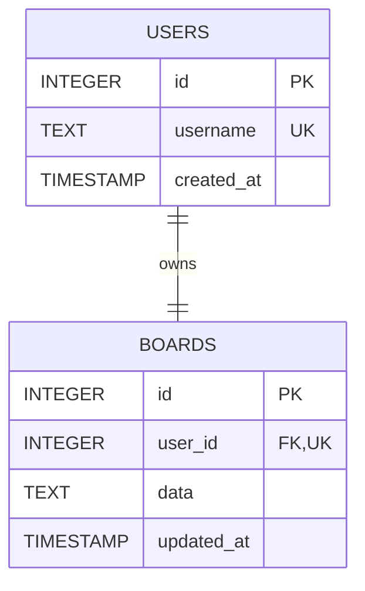

# Database Architecture and Schema Specification

## Overview
The application uses SQLite as its embedded persistence engine. It stores user records and the complete JSON representation of each user's single Kanban board.

The database file is located at `data/kanban.db` (or overridden via `DATABASE_PATH` environment variable) and is automatically initialized on application startup if it does not already exist.

---

## Relational Schema



### Table: `users`
Stores user identities. While the MVP authenticates a hardcoded demo user (`user`), the table schema supports multiple users for future scalability.

| Column | Type | Constraints | Description |
| :--- | :--- | :--- | :--- |
| `id` | `INTEGER` | `PRIMARY KEY AUTOINCREMENT` | Unique user identifier |
| `username` | `TEXT` | `UNIQUE NOT NULL` | Login username |
| `created_at` | `TIMESTAMP` | `DEFAULT CURRENT_TIMESTAMP` | Account creation timestamp |

### Table: `boards`
Stores the Kanban board data for each user. For the MVP, there is a strict 1-to-1 relationship between a user and their board (`user_id UNIQUE`).

| Column | Type | Constraints | Description |
| :--- | :--- | :--- | :--- |
| `id` | `INTEGER` | `PRIMARY KEY AUTOINCREMENT` | Unique board identifier |
| `user_id` | `INTEGER` | `UNIQUE NOT NULL`, `FOREIGN KEY (user_id) REFERENCES users(id) ON DELETE CASCADE` | Owner user ID |
| `data` | `TEXT` | `NOT NULL` | JSON serialized `BoardData` object |
| `updated_at` | `TIMESTAMP` | `DEFAULT CURRENT_TIMESTAMP` | Last modification timestamp |

---

## DDL (Data Definition Language)

```sql
PRAGMA foreign_keys = ON;

CREATE TABLE IF NOT EXISTS users (
    id INTEGER PRIMARY KEY AUTOINCREMENT,
    username TEXT UNIQUE NOT NULL,
    created_at TIMESTAMP DEFAULT CURRENT_TIMESTAMP
);

CREATE TABLE IF NOT EXISTS boards (
    id INTEGER PRIMARY KEY AUTOINCREMENT,
    user_id INTEGER UNIQUE NOT NULL,
    data TEXT NOT NULL,
    updated_at TIMESTAMP DEFAULT CURRENT_TIMESTAMP,
    FOREIGN KEY (user_id) REFERENCES users(id) ON DELETE CASCADE
);

CREATE TRIGGER IF NOT EXISTS update_boards_timestamp
AFTER UPDATE ON boards
FOR EACH ROW
BEGIN
    UPDATE boards SET updated_at = CURRENT_TIMESTAMP WHERE id = OLD.id;
END;
```

---

## BoardData JSON Document Schema

The `data` column in `boards` stores a JSON string matching the TypeScript `BoardData` structure:

```json
{
  "columns": [
    {
      "id": "col-backlog",
      "title": "Backlog",
      "cardIds": ["card-1", "card-2"]
    },
    {
      "id": "col-discovery",
      "title": "Discovery",
      "cardIds": ["card-3"]
    },
    {
      "id": "col-progress",
      "title": "In Progress",
      "cardIds": ["card-4", "card-5"]
    },
    {
      "id": "col-review",
      "title": "Review",
      "cardIds": ["card-6"]
    },
    {
      "id": "col-done",
      "title": "Done",
      "cardIds": ["card-7", "card-8"]
    }
  ],
  "cards": {
    "card-1": {
      "id": "card-1",
      "title": "Align roadmap themes",
      "details": "Draft quarterly themes with impact statements and metrics."
    },
    "card-2": {
      "id": "card-2",
      "title": "Gather customer signals",
      "details": "Review support tags, sales notes, and churn feedback."
    }
  }
}
```

---

## Data Integrity and Initialization Rules

1. **Auto-creation**: If the database file does not exist when the backend initializes, the tables and triggers are created automatically.
2. **Default Seeding**: When a user accesses their board for the first time, a default `BoardData` structure (5 initial columns and sample cards matching `initialData`) is seeded for that `user_id`.
3. **Pydantic Validation**: All board reads and writes via API endpoints (`GET /api/board`, `PUT /api/board`) are validated against Pydantic models in Python before querying or updating SQLite.
4. **Referential Integrity**: `BoardData` rejects any column that references a `cardId` not present in `cards` (a model validator in `backend/models.py` enforces `cardIds ⊆ cards.keys()`). A card present in `cards` but not referenced by any column (an orphan) is allowed, since it does not break rendering.
